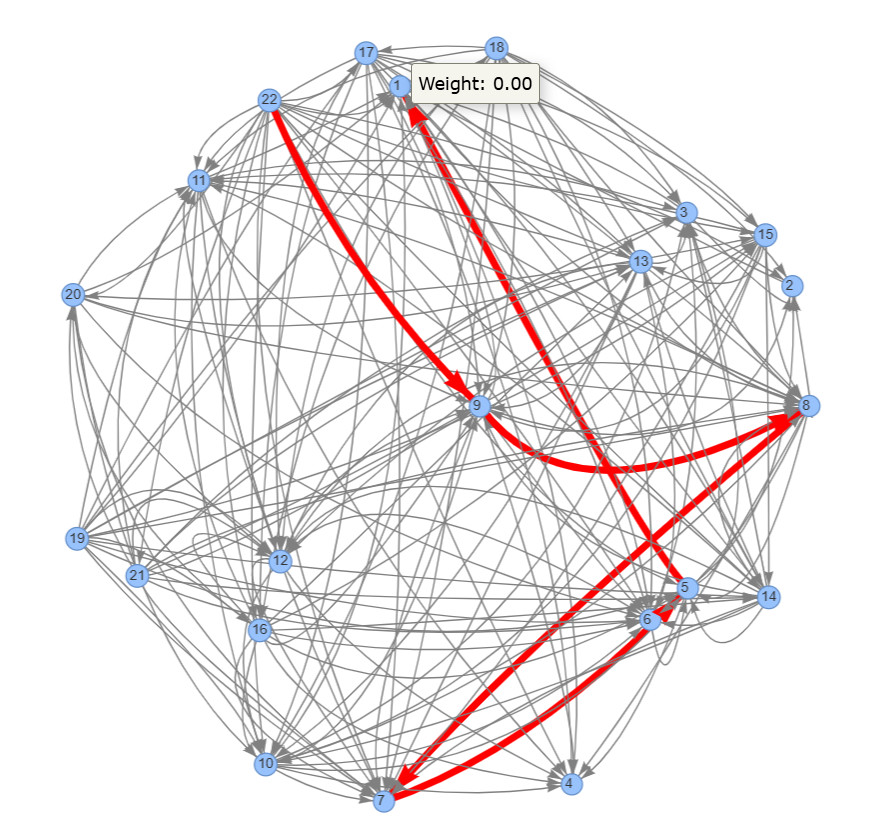
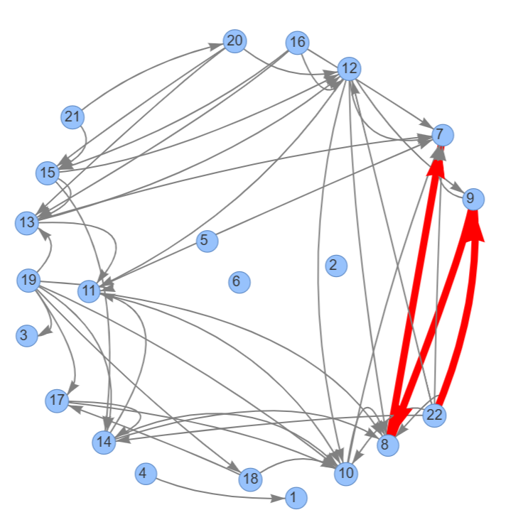

# GreedyContext

**GreedyContext** is a simple, self-contained solution to reduce token usage and latency in LLM-based applications.  
It identifies only the most semantically relevant messages from a conversation history using cosine similarity and a greedy traversal path over a graph of sentence embeddings.

---

## 🔍 What It Does

- Encodes conversation messages using `SentenceTransformers`
- Builds a **cosine similarity matrix** between all messages
- Converts it into a **strict upper triangular graph** — so messages only link to **previous** ones
- Traverses the graph using a **greedy algorithm** to extract the most relevant backward message chain
- Outputs a reduced set of messages to feed into your LLM

---

## ✅ Why Use It

- Avoid sending 100s of previous messages — pass only what's contextually relevant
- Greatly reduces token count and latency
- No summarization or vector DBs needed
- Easy to integrate in existing LLM chat workflows

---

## ⚙️ Practical Notes

- A similarity **threshold of `0.2`** is recommended  
  (It helps eliminate noise and keeps the message chain focused)
- **Pyvis** is only used for visualizing the graph — not required in production
- This is not a pip-installable module — it’s a plug-and-play solution

---

## 💡 Use Cases

- LLM-powered chatbots with long histories
- Fast, token-aware context filtering for OpenAI / Claude / LLaMA
- Replacing summarization with real-time relevance filtering
- Lightweight retrieval for memory-augmented agents

---

## 🖼️ Greedy Path Visualization

The following graphs show the difference with and without applying a similarity threshold.  
In both images, **red edges** show the final greedy path selected for context, while **gray edges** show all other semantic links.

---

### 🔻 Without Threshold (Any similarity accepted)

<p align="center">
  
</p>

A dense graph with many weak or irrelevant connections. The greedy path still works, but noise increases.

---

### ✅ With Threshold = 0.2

<p align="center">
  
</p>

Cleaner and more focused. Only strong semantic links are kept. The greedy path becomes much clearer.

> 🧠 Use `threshold = 0.2` in practice for clean context chains.

---

## 🚀 Demo (Optional)

You can run the script and inspect the printed greedy path or view the HTML graph:

```bash
pip install -r requirements.txt
python app.py
```

> This generates `interactive_graph_without_threshold.html` — open it in a browser to explore the graph interactively.

---

## 🪪 License

Licensed under the **MIT License** — free to use, modify, or integrate into your systems.

---

## 👤 Author

Built by [@MedhaviMonish](https://github.com/MedhaviMonish)  
Originally designed for real-world LLM apps needing fast, lightweight context selection.
