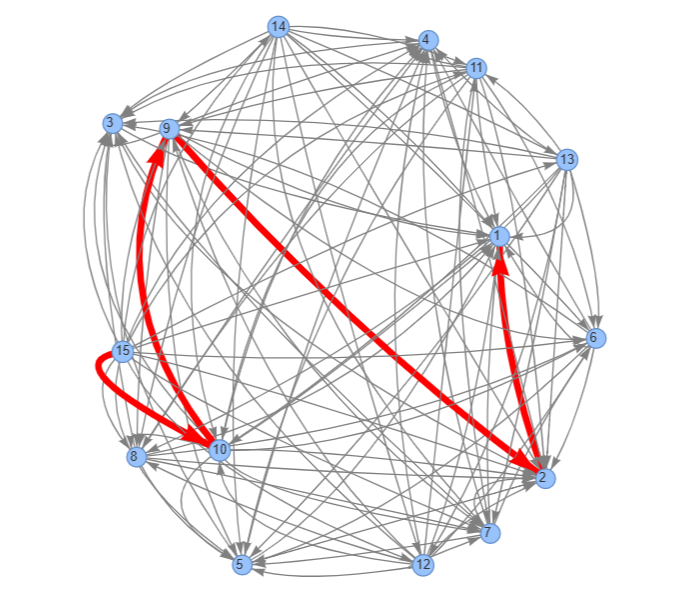
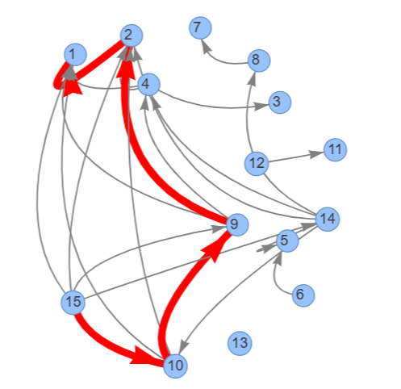

# 📌 GreedyContext: Semantic Memory Path for Conversations

**GreedyContext** is a simple yet powerful tool to trace and extract the most semantically relevant path from a long list of conversational messages (user + assistant).  
It builds a similarity graph over the messages and uses a greedy algorithm to trace backward from the latest message to its most related predecessors.

---

### ✨ Features

- Builds a semantic similarity graph using **SentenceTransformers** or **CrossEncoder**
- Applies **greedy relevance tracing** to extract core context
- Handles both `user` and `assistant` roles, preserving causal links
- Outputs filtered message trace for LLM context compression
- Optional **interactive visualization** using Pyvis

---

### 🚀 Quick Example

```
from semantic_context_graph import SemanticContextGraph

chat_messages = [
    {"role": "user", "content": "How do I start preparing for a career in robotics?"},
    {"role": "assistant", "content": "Start with mechanical basics, then learn programming and embedded systems."},
    {"role": "user", "content": "Any tips for improving productivity while studying?"},
    {"role": "assistant", "content": "Use Pomodoro timers, remove distractions, and study in intervals."},
    {"role": "user", "content": "Should I start with ROS or electronics to build autonomous vehicles?"}
]

graph = SemanticContextGraph(chat_messages)
graph.build_graph(threshold=0.2)

# Start from latest message, trace back to first
path = graph.greedy_path(start_node=len(chat_messages), goal_node=1)

# Extract useful conversation turns
used_ids, relevant_messages = graph.extract_relevant_messages(path)

# Optionally visualize
graph.save_pyvis_graph(highlight_path=used_ids, file_name="context_graph.html")

# Display
for msg in relevant_messages:
    print(f"{msg['role'].upper()}: {msg['content']}")
```

---

### 🧠 How It Works

1. **Embeds all messages** using a SentenceTransformer model (default: `all-MiniLM-L6-v2`) or scores them with `CrossEncoder`
2. **Creates a directed graph**, where edges connect semantically similar earlier messages
3. **Traverses greedily** from latest message to earliest relevant ones, following strongest similarities
4. **Returns only the subset** of messages needed to understand or reply to the final input

---

### 🔍 Visual Comparison: With vs Without Threshold

<p align="center">
  
</p>

<p align="center">
  
</p>

Even though both graphs above result in the same final semantic path (shown in red), the **second graph (with threshold)** contains fewer edges overall.

This means:
- 🔻 Fewer semantic hops to consider
- ✅ Lower noise in the graph
- 📉 Less memory usage when sending messages to the LLM

In some cases, applying a threshold **may break a path** (no connection found) — but when it works, it ensures that **only the strongest, most meaningful message connections** are preserved.

---

### 📦 Requirements

```
pip install sentence-transformers networkx numpy pyvis
```

---

### 📜 License

This project is licensed under the **MIT License**.  
You are free to use, modify, and distribute it — with credit.